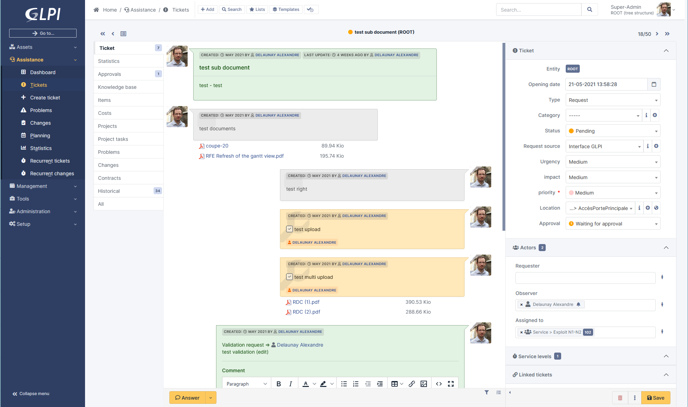

# GLPI CI/CD pipeline

Deploy GLPI server with CI/CD on Elestio

 
 

# Once deployed ...

You can open GLPI UI here:

    URL: https://[CI_CD_DOMAIN]
    login: glpi
    password: [ADMIN_PASSWORD]

You can open PHPMyAdmin here:

    URL: https://[CI_CD_DOMAIN]:26452
    login: root
    password: [ADMIN_PASSWORD]

# SMTP

To configure SMTP server, click on Setup>Notifications on the left tab.
Click on Enable followup and save.
Then click on Enable followups via email and save.
A new category appears in the right, click on Email Followsups Configuration.

- On Administrator email address write: [ADMIN_EMAIL]
- On Way of sending emails choose SMTP
- Put these credentials:

        SMTP Host=172.17.0.1
        Port=25
        SMTP Login=
        SMTP Password=
        Email Sender=[DOMAIN]@vm.elestio.app

- Save and after, click on Send a test email to the adminsitrator. You will receive a confirmation email.
